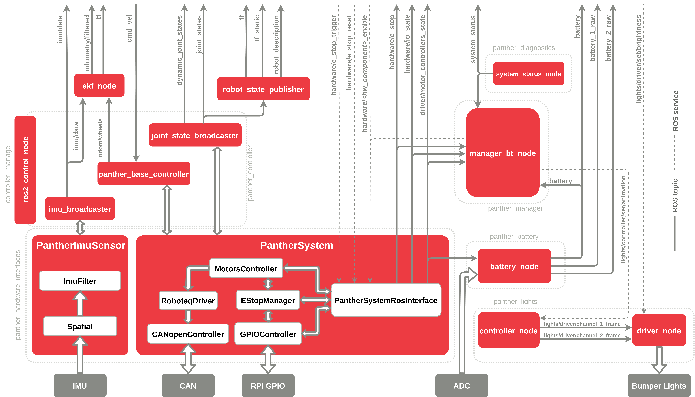

# ROS API

> [!WARNING]
> **Beta Release**
>
> Please be advised that the software you are about to use is the Beta version of the ROS 2 Driver for Panther. It is functional and the architecture will not change significantly. It was tested by the Husarion team, however, some stability issues and bugs might still occur. Additionally, the ROS 2 API may face some minor changes in the following releases.
>
> We would be grateful for your feedback related to Panther ROS 2 driver. You can reach us the following ways:
>
> - by email at [support@husarion.com](mailto:support@husarion.com)
> - via our community forum: [Husarion Community](https://community.husarion.com)
> - using issue request on [GitHub](https://github.com/husarion/panther_ros/issues)

## ROS 2 System Design

This section describes the ROS packages in the Panther ROS system. These packages are located in the [panther_ros](https://github.com/husarion/panther_ros) GitHub repository.

> [!NOTE]
> **Differences in ROS System**
>
> ROS 2 nodes differs slightly between **Panther v1.06** and **Panther v1.2+**. This is caused by internal hardware differences. Despite that, the ROS API was kept as closely matched between those revisions as possible and should be transparent in most of the use cases.

<!-- TODO: add this differences -->

The default way to communicate with Panther's hardware is via the Robot Operating System (ROS). All the drivers were written in ROS 2 framework. The ROS API is provided by ROS packages found in the GitHub repository [husarion/panther_ros](https://github.com/husarion/panther_ros). These packages are responsible for accessing the hardware components of the robot.

The graph below represents Panther's ROS system. Some topics and services have been excluded from the graph for the sake of clarity.

## ROS Interfaces

Below is information about the physical robot API. For the simulation, topics and services are identical to the physical robot, but due to certain limitations, not all interfaces are present in the simulation.

| Symbol | Meaning                         |
| ------ | ------------------------------- |
| 🤖      | Available for physical robot    |
| 🖥️      | Available in simulation         |
| ⚙️      | Requires specific configuration |

### Topics

|     | Topic                              | Description                                                                                                                                                                                                                                                                                                                                                               |
| --- | ---------------------------------- | ------------------------------------------------------------------------------------------------------------------------------------------------------------------------------------------------------------------------------------------------------------------------------------------------------------------------------------------------------------------------- |
| 🤖🖥️  | `battery/battery_status`           | Mean values of both batteries if Panther has two batteries. Otherwise, the state of the single battery will be published.  [`sensor_msgs/BatteryState`](https://docs.ros2.org/latest/api/sensor_msgs/msg/BatteryState.html)                                                                                                                                           |
| 🤖   | `battery/charging_status`          | Battery charging status value.  [`panther_msgs/ChargingStatus`](https://github.com/husarion/panther_msgs)                                                                                                                                                                                                                                                             |
| 🤖🖥️  | `cmd_vel`                          | Command velocity value.  [`geometry_msgs/Twist`](https://docs.ros2.org/latest/api/geometry_msgs/msg/Twist.html)                                                                                                                                                                                                                                                       |
| 🤖🖥️  | `diagnostics`                      | Diagnostic data.  [`diagnostic_msgs/DiagnosticArray`](https://docs.ros2.org/latest/api/diagnostic_msgs/msg/DiagnosticArray.html)                                                                                                                                                                                                                                      |
| 🤖🖥️  | `dynamic_joint_states`             | Provides information about the state of various movable joints in a robotic system.  [`control_msgs/DynamicJointState`](https://github.com/ros-controls/control_msgs/blob/master/control_msgs/msg/DynamicJointState.msg)                                                                                                                                              |
| 🤖🖥️⚙️ | `gps/fix`                          | Raw GPS data.  [`sensor_msgs/NavSatFix`](https://docs.ros2.org/latest/api/sensor_msgs/msg/NavSatFix.html)                                                                                                                                                                                                                                                             |
| 🤖🖥️⚙️ | `gps/filtered`                     | Filtered GPS position after fusing odometry data.  [`sensor_msgs/NavSatFix`](https://docs.ros2.org/latest/api/sensor_msgs/msg/NavSatFix.html)                                                                                                                                                                                                                         |
| 🤖   | `hardware/e_stop`                  | Current E-stop state.  [`std_msgs/Bool`](https://docs.ros.org/en/latest/api/std_msgs/html/msg/Bool.html)                                                                                                                                                                                                                                                              |
| 🤖   | `hardware/io_state`                | Current IO state.  [`panther_msgs/IOState`](https://github.com/husarion/panther_msgs)                                                                                                                                                                                                                                                                                 |
| 🤖🖥️  | `hardware/motor_controllers_state` | Current motor controllers' state and error flags. Subscribed if using Roboteq motor controllers data.  [`panther_msgs/DriverState`](https://github.com/husarion/panther_msgs)                                                                                                                                                                                         |
| 🤖🖥️  | `imu/data`                         | Filtered IMU data.  [`sensor_msgs/Imu`](https://docs.ros2.org/latest/api/sensor_msgs/msg/Imu.html)                                                                                                                                                                                                                                                                    |
| 🤖🖥️  | `joint_states`                     | Provides information about the state of various joints in a robotic system.  [`sensor_msgs/JointState`](https://docs.ros2.org/latest/api/sensor_msgs/msg/JointState.html)                                                                                                                                                                                             |
| 🤖🖥️  | `lights/channel_1_frame`           | Frame to be displayed on robot Front Bumper Lights.  [`sensor_msgs/Image`](https://docs.ros2.org/latest/api/sensor_msgs/msg/Image.html)                                                                                                                                                                                                                               |
| 🤖🖥️  | `lights/channel_2_frame`           | Frame to be displayed on robot Rear Bumper Lights.  [`sensor_msgs/Image`](https://docs.ros2.org/latest/api/sensor_msgs/msg/Image.html)                                                                                                                                                                                                                                |
| 🤖🖥️  | `localization/set_pose`            | Set the pose of the EKF node.  [`geometry_msgs/PoseWithCovarianceStamped`](https://docs.ros2.org/latest/api/geometry_msgs/msg/PoseWithCovarianceStamped.html)                                                                                                                                                                                                         |
| 🤖🖥️  | `odometry/filtered`                | Contains information about the filtered position and orientation. When `localization_mode` is `relative`, the position and orientation are relative to the starting point. When `localization_mode` is `enu`, the orientation is relative to the east-north-up (ENU) coordinates.  [`nav_msgs/Odometry`](https://docs.ros2.org/latest/api/nav_msgs/msg/Odometry.html) |
| 🤖🖥️  | `odometry/wheels`                  | Robot odometry calculated from wheels.  [`nav_msgs/Odometry`](https://docs.ros2.org/latest/api/nav_msgs/msg/Odometry.html)                                                                                                                                                                                                                                            |
| 🤖🖥️  | `robot_description`                | Contains information about robot description from URDF file.   [`std_msgs/String`](https://docs.ros2.org/latest/api/std_msgs/msg/String.html)                                                                                                                                                                                                                         |
| 🤖   | `system_status`                    | State of the system, including Built-in Computer's CPU temperature and load.   [`panther_msgs/SystemStatus`](https://github.com/husarion/panther_msgs)                                                                                                                                                                                                                |
| 🤖🖥️  | `tf`                               | Transforms of robot system.  [`tf2_msgs/TFMessage`](https://docs.ros2.org/latest/api/tf2_msgs/msg/TFMessage.html)                                                                                                                                                                                                                                                     |
| 🤖🖥️  | `tf_static`                        | Static transforms of robot system.  [`tf2_msgs/TFMessage`](https://docs.ros2.org/latest/api/tf2_msgs/msg/TFMessage.html)                                                                                                                                                                                                                                              |

#### Hidden topics

|     | Topic                           | Description                                                                                                                                                           |
| --- | ------------------------------- | --------------------------------------------------------------------------------------------------------------------------------------------------------------------- |
| 🤖   | `_battery/battery_1_status_raw` | First battery raw state.  [`sensor_msgs/BatteryState`](https://docs.ros2.org/latest/api/sensor_msgs/msg/BatteryState.html)                                        |
| 🤖   | `_battery/battery_2_status_raw` | Second battery raw state. Published if second battery detected.  [`sensor_msgs/BatteryState`](https://docs.ros2.org/latest/api/sensor_msgs/msg/BatteryState.html) |
| 🤖🖥️⚙️ | `_odometry/gps`                 | Transformed raw GPS data to odometry format.  [`nav_msgs/Odometry`](https://docs.ros2.org/latest/api/nav_msgs/msg/Odometry.html)                                  |

### Services

| Service                                           | Description                                                                                                                                                                                            |
| ------------------------------------------------- | ------------------------------------------------------------------------------------------------------------------------------------------------------------------------------------------------------ |
| `controller_manager/configure_controller`         | Manage lifecycle transition.  [controller_manager_msgs/srv/ConfigureController](https://github.com/ros-controls/ros2_control/tree/master/controller_manager_msgs)                                  |
| `controller_manager/list_controller_types`        | Output the available controller types and their base classes.  [controller_manager_msgs/srv/ListControllerTypes](https://github.com/ros-controls/ros2_control/tree/master/controller_manager_msgs) |
| `controller_manager/list_controllers`             | Output the list of loaded controllers, their type and status.  [controller_manager_msgs/srv/ListControllers](https://github.com/ros-controls/ros2_control/tree/master/controller_manager_msgs)     |
| `controller_manager/list_hardware_components`     | Output the list of available hardware components.  [controller_manager_msgs/srv/ListHardwareComponents](https://github.com/ros-controls/ros2_control/tree/master/controller_manager_msgs)          |
| `controller_manager/list_hardware_interfaces`     | Output the list of available command and state interfaces.  [controller_manager_msgs/srv/ListHardwareInterfaces](https://github.com/ros-controls/ros2_control/tree/master/controller_manager_msgs) |
| `controller_manager/load_controller`              | Load a controller in a controller manager.  [controller_manager_msgs/srv/LoadController](https://github.com/ros-controls/ros2_control/tree/master/controller_manager_msgs)                         |
| `controller_manager/reload_controller_libraries`  | Reload controller libraries.  [controller_manager_msgs/srv/ReloadControllerLibraries](https://github.com/ros-controls/ros2_control/tree/master/controller_manager_msgs)                            |
| `controller_manager/set_hardware_component_state` | Adjust the state of the hardware component.  [controller_manager_msgs/srv/SetHardwareComponentState](https://github.com/ros-controls/ros2_control/tree/master/controller_manager_msgs)             |
| `controller_manager/switch_controller`            | Switch controllers in a controller manager.  [controller_manager_msgs/srv/SwitchController](https://github.com/ros-controls/ros2_control/tree/master/controller_manager_msgs)                      |
| `controller_manager/unload_controller`            | Unload a controller in a controller manager.  [controller_manager_msgs/srv/UnloadController](https://github.com/ros-controls/ros2_control/tree/master/controller_manager_msgs)                     |
| `hardware/aux_power_enable`                       | Enables or disables AUX power.  [std_srvs/srv/SetBool](https://docs.ros2.org/latest/api/std_srvs/srv/SetBool.html)                                                                                 |
| `hardware/charger_enable`                         | Enables or disables charger.  [std_srvs/srv/SetBool](https://docs.ros2.org/latest/api/std_srvs/srv/SetBool.html)                                                                                   |
| `hardware/digital_power_enable`                   | Enables or disables digital power.  [std_srvs/srv/SetBool](https://docs.ros2.org/latest/api/std_srvs/srv/SetBool.html)                                                                             |
| `hardware/e_stop_reset`                           | Resets E-stop.  [std_srvs/srv/Trigger](https://docs.ros2.org/latest/api/std_srvs/srv/Trigger.html)                                                                                                 |
| `hardware/e_stop_trigger`                         | Triggers E-stop.  [std_srvs/srv/Trigger](https://docs.ros2.org/latest/api/std_srvs/srv/Trigger.html)                                                                                               |
| `hardware/fan_enable`                             | Enables or disables fan.  [std_srvs/srv/SetBool](https://docs.ros2.org/latest/api/std_srvs/srv/SetBool.html)                                                                                       |
| `hardware/motor_power_enable`                     | Enables or disables motor power.  [std_srvs/srv/SetBool](https://docs.ros2.org/latest/api/std_srvs/srv/SetBool.html)                                                                               |
| `lights/set_animation`                            | Sets LED animation.  [panther_msgs/srv/SetLEDAnimation](https://github.com/husarion/panther_msgs)                                                                                                  |
| `lights/set_brightness`                           | Sets global LED brightness, value ranges from **0.0** to **1.0**.  [panther_msgs/SetLEDBrightness](https://github.com/husarion/panther_msgs)                                                       |
| `lights/driver/set/brightness`                    | Sets LED brightness.  [panther_msgs/srv/SetLEDBrightness](https://github.com/husarion/panther_msgs)                                                                                                |
| `localization/enable`                             | Enable EKF node.  [std_srvs/srv/Empty](https://docs.ros2.org/latest/api/std_srvs/srv/Empty.html)                                                                                                   |
| `localization/set_pose`                           | Set pose of EKF node.  [robot_localization/srv/SetPose](https://github.com/cra-ros-pkg/robot_localization/tree/ros2)                                                                               |
| `localization/toggle`                             | Toggle filter processing in the EKF node.  [robot_localization/srv/ToggleFilterProcessing](https://github.com/cra-ros-pkg/robot_localization/tree/ros2)                                            |
