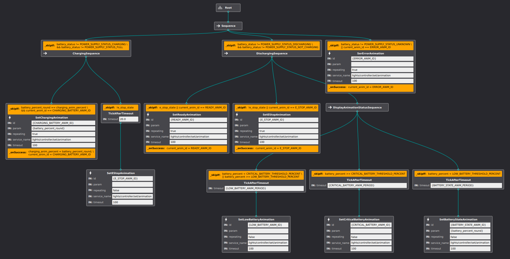
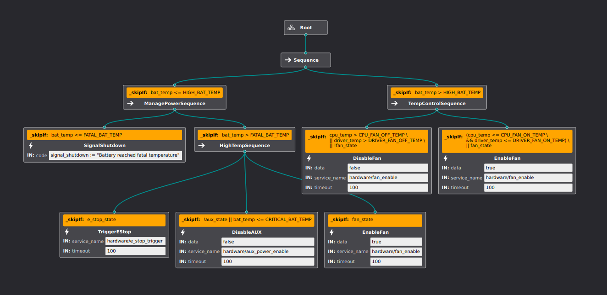
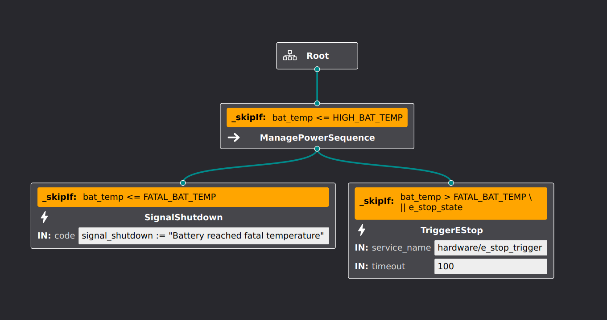

# panther_manager

A package containing nodes responsible for high-level control of Husarion Panther robot.

## ROS Nodes

### manager_bt_node

Node responsible for managing the Husarion Panther robot. Composes control of three behavior trees responsible for handling LED panels, safety features and software shutdown of components.

To set up connection with a new user computer, login to the built-in computer with `ssh husarion@10.15.20.2`.
Add built-in computer's public key to **known_hosts** of a computer you want to shut down automatically:
``` bash
ssh-copy-id username@10.15.20.XX
```

To allow your computer to be shut down without sudo password, ssh into it and execute:
``` bash
echo $USERNAME 'ALL=(ALL) NOPASSWD: /sbin/poweroff, /sbin/reboot, /sbin/shutdown' | sudo EDITOR='tee -a' visudo
```

#### Subscribes

- `/panther/battery` [*sensor_msgs/BatteryState*]: state of internal battery.
- `/panther/driver/motor_controllers_state` [*panther_msgsDriverState*]: state of motor controllers.
- `/panther/hardware/e_stop` [*std_msgs/Bool*]: state of emergency stop.
- `/panther/hardware/io_state` [*panther_msgs/IOState*]: state of IO pins.
- `/panther/system_status` [*panther_msgs/SystemStatus*]: state of system including CPU temperature and load.

#### Services subscribed (default trees)

- `/panther/hardware/aux_power_enable` [*std_srvs/SetBool*]: enables aux power output.
- `/panther/hardware/e_stop_trigger` [*std_srvs/Trigger*]: triggers e-stop.
- `/panther/hardware/fan_enable` [*std_srvs/SetBool*]: enables fan.
- `/panther/lights/controller/set/animation` [*panther_msgs/SetLEDAnimation*]: allows setting animation on LED panel based on animation ID.

#### Parameters

- `~bt_project_file` [*string*, default: **$(find panther_manager)/config/PantherBT.btproj**]: path to a BehaviorTree project.
- `~plugin_libs` [*list*, default: **Empty list**]: list with names of plugins that are used in BT project.
- `~ros_plugin_libs` [*list*, default: **Empty list**]: list with names of ROS plugins that are used in BT project.  


- `~battery_percent_window_len` [*int*, default: **6**]: <int>("battery_percent_window_len", 6
- `~battery_temp_window_len` [*int*, default: **6**]: moving average window length used to smooth out temperature readings of battery.
- `~cpu_temp_window_len` [*int*, default: **6**]: moving average window length used to smooth out temperature readings of CPU.
- `~driver_temp_window_len` [*int*, default: **6**]: moving average window length used to smooth out temperature readings of each driver.
- `~lights/battery_state_anim_period` [*float*, default: **120.0**]: time in seconds to wait before repeating animation representing current battery percentage.
- `~lights/critical_battery_anim_period` [*float*, default: **15.0**]: time in seconds to wait before repeating animation indicating a critical battery state.
- `~lights/critical_battery_threshold_percent` [*float*, default: **0.1**]: if battery percentage drops below this value, animation indicating a critical battery state will start being displayed.
- `~lights/low_battery_anim_period` [*float*, default: **30.0**]: time in seconds to wait before repeating animation indicating a low battery state.
- `~lights/low_battery_threshold_percent` [*float*, default: **0.4**]: if the battery percentage drops below this value, animation indicating a low battery state will start being displayed.
- `~lights/update_charging_anim_step` [*float*, default: **0.1**]: percentage value representing a step for updating the charging battery animation.
- `~safety/cpu_fan_off_temp` [*float*, default: **60.0**]: temperature in **deg C** of CPU, below which the fan is turned off.
- `~safety/cpu_fan_on_temp` [*float*, default: **70.0**]: temperature in **deg C** of CPU, above which the fan is turned on.
- `~safety/critical_bat_temp` [*float*, default: **59.0**]: extends `high_bat_temp` by turning off AUX power.
- `~safety/driver_fan_off_temp` [*float*, default: **35.0**]: temperature in **deg C** of any drivers below which the fan is turned off.
- `~safety/driver_fan_on_temp` [*float*, default: **45.0**]: temperature in **deg C** of any drivers above which the fan is turned on.
- `~safety/fatal_bat_temp` [*float*, default: **62.0**]: temperature of battery above which robot is shutdown.
- `~safety/high_bat_temp` [*float*, default: **55.0**]: temperature of battery above which robots starts displaying warning log and e-stop is triggered.
- `~shutdown_hosts_file` [*string*, default: **None**]: path to a YAML file containing list of hosts to request shutdown. To correctly format the YAML file, include a **hosts** field consisting of a list with the following fields:
  - `command` [*string*, default: **sudo shutdown now**]: command executed on shutdown of given device.
  - `ip` [*string*, default: **None**]: IP of a host to shutdown over SSH.
  - `username` [*string*, default: **None**]: username used to log in to over SSH.

### system_status_node.py

Publishes stats status of the built-in computer. Stats include CPU utilization and temperature, as well as disc and RAM usage.

#### Publishes

- `/panther/system_status` [*panther_msgs/SystemStatus*]: information about internal computer CPU temperature, utilization, disc and RAM usage.

## BehaviorTree

For a BehaviorTree project to work correctly, it must contain three trees with names as described below. Files with trees XML descriptions can be shared between projects. Each tree is provided with a set of default blackboard entries (described below) which can be used to specify the behavior of a given tree.

### Nodes

#### Actions

- `CallSetBoolService` - allows calling standard **std_srvs/SetBool** ROS service. Provided ports are:
  - `data` [*input*, *bool*, default: **None**]: service data - true / false value.
  - `service_name` [*input*, *string*, default: **None**]: ROS service name.
  - `timeout` [*input*, *unsigned*, default: **100**]: time in s to wait for service to become available.
- `CallSetLedAnimationService` - allows calling custom type **panther_msgs/SetLEDAnimation** ROS service. Provided ports are:
  - `id` [*input*, *unsigned*, default: **None**]: animation ID.
  - `param` [*input*, *string*, default: **None**]: optional parameter.
  - `repeating` [*input*, *bool*, default: **false**]: indicates if animation should repeat.
  - `service_name` [*input*, *string*, default: **None**]: ROS service name.
  - `timeout` [*input*, *unsigned*, default: **100**]: time in s to wait for service to become available.
- `CallTriggerService` - allows calling standard **std_srvs/Trigger** ROS service. Provided ports are:
  - `service_name` [*input*, *string*, default: **None**]: ROS service name.
  - `timeout` [*input*, *unsigned*, default: **100**]: time in s to wait for service to become available.
- `ShutdownHostsFromFile` - allows to shutdown devices based on a YAML file. Returns `FAILURE` only when a YAML file is incorrect or a path to the file does not exist. If it fails to execute a command in a remote host, node will proceed to the next device from the list. Provided ports are:
  - `shutdown_host_file` [*input*, *string*, default: **None**]: global path to YAML file with hosts to shutdown.
- `ShutdownSingleHost` - allows to shutdown single device. Will return `SUCCESS` only when the device can be reached and the command was executed. Provided ports are:
  - `command` [*input*, *string*, default: **sudo shutdown now**]: command to execute on shutdown.
  - `ip` [*input*, *string*, default: **None**]: IP of the host to shutdown.
  - `ping_for_success` [*input*, *bool*, default: **true**]: ping host until it is not available or timeout is reached.
  - `port` [*input*, *string*, default: **22**]: SSH communication port.
  - `timeout` [*input*, *string*, default: **5.0**]: time in s to wait for the host to shutdown.
  - `user` [*input*, *string*, default: **None**]: user to log into while executing shutdown command.
- `SignalShutdown` - signals shutdown of the robot. Provided ports are:
  - `message` [*input*, *string*, default: **None**]: message with reason for robot to shutdown.

#### Decorators

- `TickAfterTimeout` - will skip a child until the specified time has passed. It can be used to specify the frequency at which a node or subtree is triggered. Provided ports are:
  - `timeout` [*input*, *unsigned*, default: **None**]: time in s to wait before ticking child again.

### Trees

#### Lights 

Tree responsible for scheduling animations displayed on LED panels, based on the Husarion Panther robot's system state.

<p align="center">
  
</p>

Default blackboard entries:
- `battery_percent` [*float*, defautl: **None**]: moving average of battery percentage.
- `battery_percent_round` [*string*, default: **None**] battery percentage raunded to a value specified with `~lights/update_charging_anim_step` and casted to string.
- `battery_status` [*unsigned*, defautl: **None**]: current battery status.
- `charging_anim_percent` [*string*, default: **None**]: value of charging animation battery percentage casted to string.
- `current_anim_id` [*int*, default: **-1**]: ID of currently displayed animation.
- `e_stop_state` [*bool*, defautl: **None**]: state of emergency stop.

Default constant blackboard entries:
- `BATTERY_STATE_ANIM_PERIOD` [*float*, default: **120.0**]: refers to `battery_state_anim_period` ROS parameter.
- `CRITICAL_BATTERY_ANIM_PERIOD` [*float*, default: **15.0**]: refers to `critical_battery_anim_period` ROS parameter.
- `CRITICAL_BATTERY_THRESHOLD_PERCENT` [*float*, default: **0.1**]: refers to `critical_battery_threshold_percent` ROS parameter.
- `LOW_BATTERY_ANIM_PERIOD` [*float*, default: **30.0**]: refers to `low_battery_anim_period` ROS parameter.
- `LOW_BATTERY_THRESHOLD_PERCENT` [*float*, default: **0.4**]: refers to `low_battery_threshold_percent` ROS parameter.
- `E_STOP_ANIM_ID` [*unsigned*, value: **0**]: animation ID constant parsed from `panther_msgs::LEDAnimation::E_STOP`.
- `READY_ANIM_ID` [*unsigned*, value: **1**]: animation ID constant parsed from `panther_msgs::LEDAnimation::READY`.
- `ERROR_ANIM_ID` [*unsigned*, value: **2**]: animation ID constant parsed from `panther_msgs::LEDAnimation::ERROR`.
- `MANUAL_ACTION_ANIM_ID` [*unsigned*, value: **3**]: animation ID constant parsed from `panther_msgs::LEDAnimation::MANUAL_ACTION`.
- `AUTONOMOUS_ACTION_ANIM_ID` [*unsigned*, value: **4**]: animation ID constant parsed from `panther_msgs::LEDAnimation::AUTONOMOUS_ACTION`.
- `GOAL_ACHIEVED_ANIM_ID` [*unsigned*, value: **5**]: animation ID constant parsed from `panther_msgs::LEDAnimation::GOAL_ACHIEVED`.
- `LOW_BATTERY_ANIM_ID` [*unsigned*, value: **6**]: animation ID constant parsed from `panther_msgs::LEDAnimation::LOW_BATTERY`.
- `CRITICAL_BATTERY_ANIM_ID` [*unsigned*, value: **7**]: animation ID constant parsed from `panther_msgs::LEDAnimation::CRITICAL_BATTERY`.
- `BATTERY_STATE_ANIM_ID` [*unsigned*, value: **8**]: animation ID constant parsed from `panther_msgs::LEDAnimation::BATTERY_STATE`.
- `CHARGING_BATTERY_ANIM_ID` [*unsigned*, value: **9**]: animation ID constant parsed from `panther_msgs::LEDAnimation::CHARGING_BATTERY`.
- `POWER_SUPPLY_STATUS_UNKNOWN` [*unsigned*, value: **0**]: power supply status constant parsed from `sensor_msgs::BatteryState::POWER_SUPPLY_STATUS_UNKNOWN`.
- `POWER_SUPPLY_STATUS_CHARGING` [*unsigned*, value: **1**]: power supply status constant parsed from `sensor_msgs::BatteryState::POWER_SUPPLY_STATUS_CHARGING`.
- `POWER_SUPPLY_STATUS_DISCHARGING` [*unsigned*, value: **2**]: power supply status constant parsed from `sensor_msgs::BatteryState::POWER_SUPPLY_STATUS_DISCHARGING`.
- `POWER_SUPPLY_STATUS_NOT_CHARGING` [*unsigned*, value: **3**]: power supply status constant parsed from `sensor_msgs::BatteryState::POWER_SUPPLY_STATUS_NOT_CHARGING`.
- `POWER_SUPPLY_STATUS_FULL` [*unsigned*, value: **4**]: power supply status constant parsed from `sensor_msgs::BatteryState::POWER_SUPPLY_STATUS_FULL`.

### Safety 
 
Tree responsible for monitoring the Panther robot's state and handling safety measures, such as cooling the robot in case of high CPU or battery temperature.

Default tree for Panther version 1.2 and later:

<p align="center">
  
</p>

Default tree for Panther version 1.06 and ealier:

<p align="center">
  
</p>

Default blackboard entries:
- `aux_state` [*bool*, default: **None**]: state of AUX power.
- `e_stop_state` [*bool*, default: **None**]: state of emergency stop.
- `fan_state` [*bool*, default: **None**]: state of fan.
- `bat_temp` [*double*, default: **None**]: moving average of battery temperature.
- `cpu_temp` [*double*, default: **None**]: moving average of cpu temperature
- `driver_temp` [*double*, default: **None**]: moving average of driver temperature, for condition simplification only motor driver with higher temperature is considered.

Default constant blackboard entries:
- `CPU_FAN_OFF_TEMP` [*float*, default: **60.0**]: refers to `cpu_fan_off_temp` ROS parameter.
- `CPU_FAN_ON_TEMP` [*float*, default: **70.0**]: refers to `cpu_fan_on_temp` ROS parameter.
- `CRITICAL_BAT_TEMP` [*float*, default: **59.0**]: refers to `critical_bat_temp` ROS parameter.
- `DRIVER_FAN_OFF_TEMP` [*float*, default: **35.0**]: refers to `driver_fan_off_temp` ROS parameter.
- `DRIVER_FAN_ON_TEMP` [*float*, default: **45.0**]: refers to `driver_fan_on_temp` ROS parameter.
- `FATAL_BAT_TEMP` [*float*, default: **62.0**]: refers to `fatal_bat_temp` ROS parameter.
- `HIGH_BAT_TEMP` [*float*, default: **55.0**]: refers to `high_bat_temp` ROS parameter.

#### Shutdown 

Tree responsible for graceful shutdown of robot components, user computers, and the built-in computer. By default, it will proceed to shutdown all computers defined in a YAML file with a path defined by the `~shutdown_host_file` ROS parameter.

<p align="center">
  
</p>

Default constant blackboard entries:
  - `SHUTDOWN_HOSTS_FILE` [*string*, default: **None**]: refers to `shutdown_hosts_file` ROS parameter.

